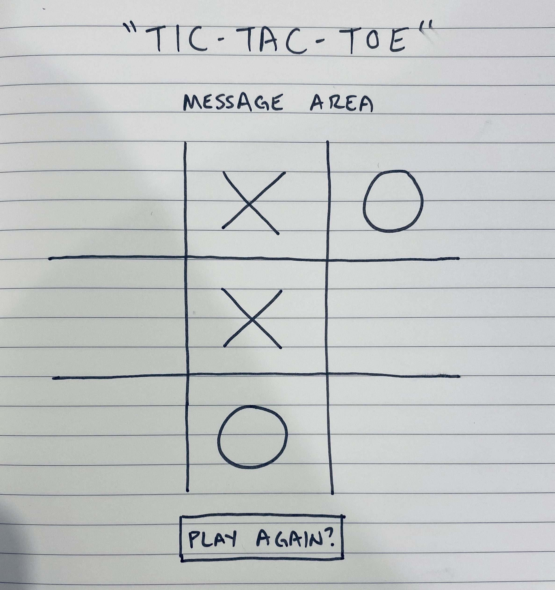

# **Tic-Tac-Toe**

### Date: 1/31/2020

#### By: Michael Lackey
#### [GitHub](https://github.com/mlackey9601) | [LinkedIn](https://www.linkedin.com/in/michaelglackey/)
***

### ***Description***

> ##### A simple tic-tac-toe game with conditions for win/lose/draw.
***

### ***Technologies Used***

> ##### JavaScript, HTML, CSS
***

### ***Getting Started***

> ##### Start by deciding who goes first.  The objective is to acheive 3 in a row, while preventing your opponent.
> ##### The project can be viewed [here](https://mlackey9601.github.io/Tic-Tac-Toe/).
***

### ***Screenshots***

> ###### Rough Wireframe
> 
***

### ***User Experience***

> #### User Story #1
> ##### Tony is extremely competitive and is looking for a game where he can take on his friends without spending a lot of time explaining how to play.
> #### User Story #2
> ##### Lisa and her sister are trying to resolve a dispute in a fair and just manner.  They need an unbiased medium in which to compete to determine who wins.
> #### As a user...
> * ##### I should be able to click an area of the board and my letter appear.
> * ##### I should expect the turn to switch to the opposing player after I have gone.
> * ##### I should see an alert appear when I have acheived 3 in a row.
> * ##### I should have the option to play again after the completion of the game.
> * ##### It should be clear to me when no one has won the game.
***

### ***Future Updates***

> * ##### ~~Message section that describes whose turn it is and a win/lose/draw update~~
> * ##### ~~Unique color for each player~~
> * ##### ~~JS Animations~~
> * ##### ~~Self-hosted chalk font~~
> * ##### ~~Play Again button that only appears when the game has ended~~
> * ##### Play Again button does not "refresh" the page
> * ##### Win counter for each player
> * ##### 30 second turn timer before a random selection is made for the player
***

### ***Credits***

> ##### Credit: [Chalkboard Background](https://researchprojectbenjervis.files.wordpress.com/2015/02/llk_chalkboard-background.jpg)
>
> ##### Credit: [Chalk Font](https://www.dafont.com/right-chalk.font)
>  
> ##### Credit: [JS Animations](https://daneden.github.io/animate.css/)
***