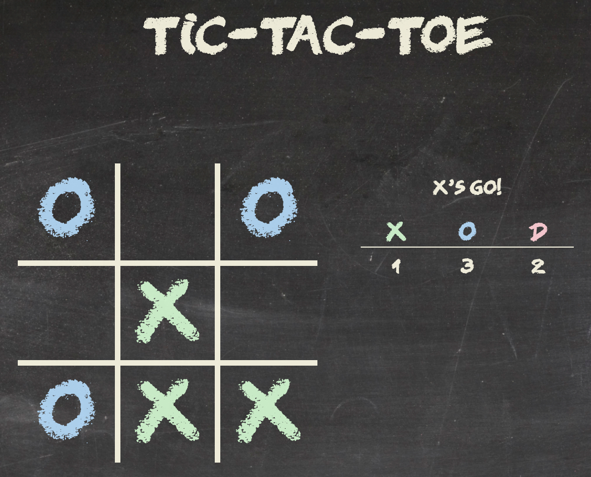

### Date: 1/31/2020

#### By: Michael Lackey
#### [Website](https://michaellackey.com/) | [GitHub](https://github.com/mlackey9601) | [LinkedIn](https://www.linkedin.com/in/michaelglackey/)
***

### ***Description***

##### A simple tic-tac-toe game built with VanillaJS with conditions for win/lose/draw. This project was built over the course of two days.
***

### ***Technologies Used***

***

### ***Getting Started***

##### Start by deciding who goes first.  The objective is to achieve 3 in a row, while preventing your opponent from doing the same.
##### The project was deployed on GitHub Pages and can be viewed [here](https://mlackey9601.github.io/Tic-Tac-Toe/).
***

### ***Screenshots***

###### Tic-Tac-Toe

***

### ***Future Updates***

- [x] ~~Message section that describes whose turn it is and a win/lose/draw update~~
- [x] ~~Unique color for each player~~
- [x] ~~JS Animations~~
- [x] ~~Self-hosted chalk font~~
- [x] ~~Play Again button that only appears when the game has ended~~
- [x] ~~Play Again button does not "refresh" the page~~
- [ ] Win counter for each player
- [ ] 30 second turn timer before a random selection is made for the player
- [ ] 1 Player Mode where a user can play against the computer
***

### ***Credits***

##### Background: [Chalkboard](https://researchprojectbenjervis.files.wordpress.com/2015/02/llk_chalkboard-background.jpg)

##### Font: [Right Chalk](https://www.dafont.com/right-chalk.font)

##### Animations: [Animate.css](https://daneden.github.io/animate.css/)
***
